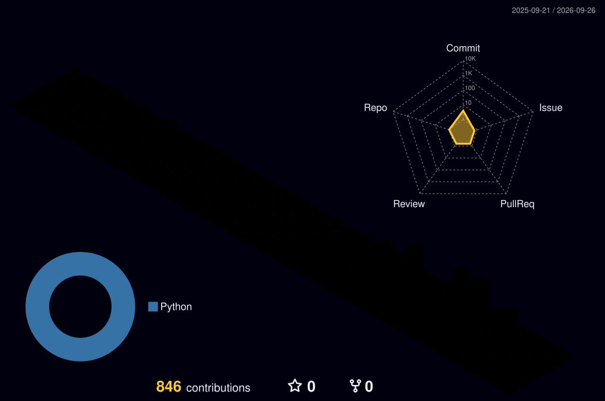

Game developer and web engineer. I build gameplay systems in **Unity 6**, ship **Next.js** sites that load fast, and get local businesses to the top of Google Maps.

### What I build

**Blacksmith Together** — co-op blacksmith management RPG.
Unity 6 · URP Forward+ · Netcode for GameObjects. I write gameplay systems and lead a small team of friends under the **Alka Games** name.

**Caesar SEO** — freelance studio for local search and custom marketing sites.
Next.js builds at Lighthouse 93+, Google Business Profile work, and structured data for clinics and local businesses across Türkiye.

**Dental clinic directory** — a Next.js directory built end to end: data model, search, city pages, schema markup.

### Stack

### Numbers

<picture>
  <source media="(prefers-color-scheme: dark)" srcset="profile/snake-dark.svg">
  
</picture>

<!-- 3D graph instead of the snake: replace the <picture> block above with

-->

### Elsewhere

[LinkedIn](https://www.linkedin.com/in/muhammedbjorncelik/)

